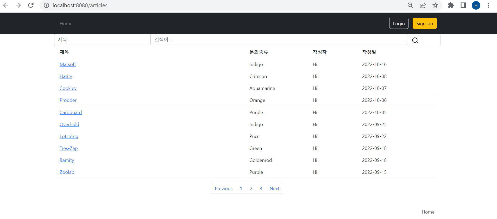
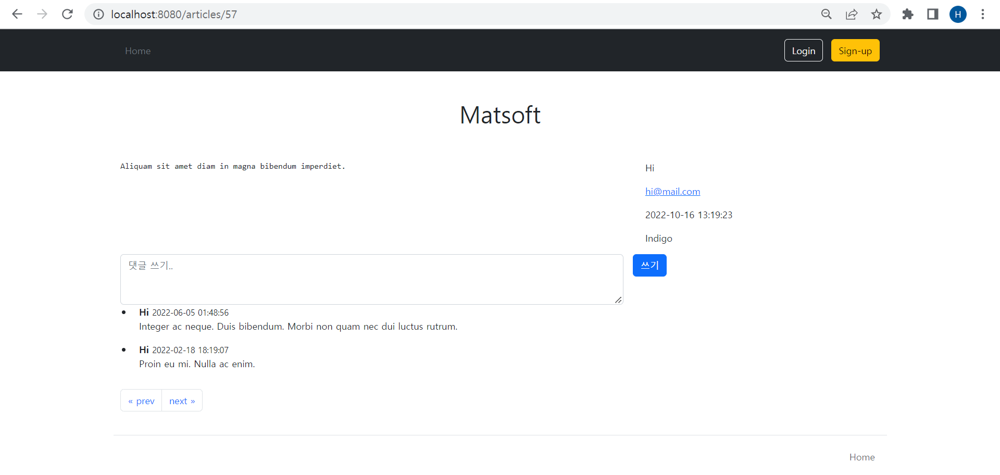
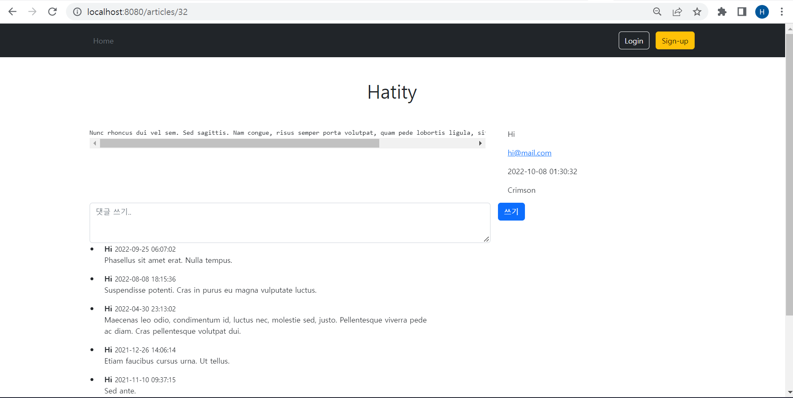

# [프로젝트] React - Spring Boot 상품 관리, 주문관리 API 구현
## 구현 기능
### 1대1 문의 게시판 기능(미완성)
- 게시판 뷰는 리액트가 아닌 WAS서버 상에서 구현 -> 추후 완성되면 리액트로 변경
- JPA를 사용해서 구현
- DB에 삽입한 데이터는 목업데이터를 대량으로 생산해서 넣은 것

[api]

| uri | method | 기능 |
| --- | --- | --- |
| /api/v1/articles | GET | 게시글 리스트 조회 |
| /api/v1/articles/{article-id} | GET | 게시글 단일 조회 |
| /api/v1/articles | POST | 게시글 추가 |
| /api/v1/articles/{article-id} | PUT, PATCH | 게시글 수정 |
| /api/v1/articles/{article-id} | DELETE | 게시글 삭제 |
| /api/v1/articleComments | GET | 댓글 리스트 조회 |
| /api/v1/articleComments/{article-comment-id} | GET | 댓글 단일 조회 |
| /api/v1/articles/{article-id}/articleComments | GET | 게시글에 연관된 댓글 리스트 조회 |
| /api/v1/articles/{article-id}/articleComments/{article-comment-id} | GET | 게시글에 연관된 댓글 단일 조회 |
| /api/v1/articles/{article-id}/articleComments | POST | 댓글 등록 |
| /api/v1/articles/{article-id}/articleComments/{article-comment-id} | PUT, PATCH | 댓글 수정 |
| /api/v1/articles/{article-id}/articleComments/{article-comment-id} | DELETE | 댓글 삭제 |

- http://localhost:8080/api/v1/ 에서 잘 동작하는 것을 확인 가능

[뷰]

| uri | method | 기능 |
| --- | --- | --- |
| /login | GET | 로그인 페이지 |
| /articles | GET | 게시판 페이지 |
| /articles/{article-id} | GET | 게시글 페이지 |

- http://localhost:8080/articles 에 접속하면 DB의 게시글 정보를 불러와서 웹에 표현해줌
  
- 각 게시글을 클릭하면 해당 게시글의 정보를 DB에서 불러와서 보여줌
  
  

## 추후 구현 할 기능
1. 게시판 페이징
2. 게시판 검색(제목, 본문, 이름, 문의 종류)
3. 게시글 등록
4. 게시글 댓글
5. Spring Security 완성(로그인, 회원가입)
6. 고객과 관리자 페이지 분리
7. 리액트로 변환
